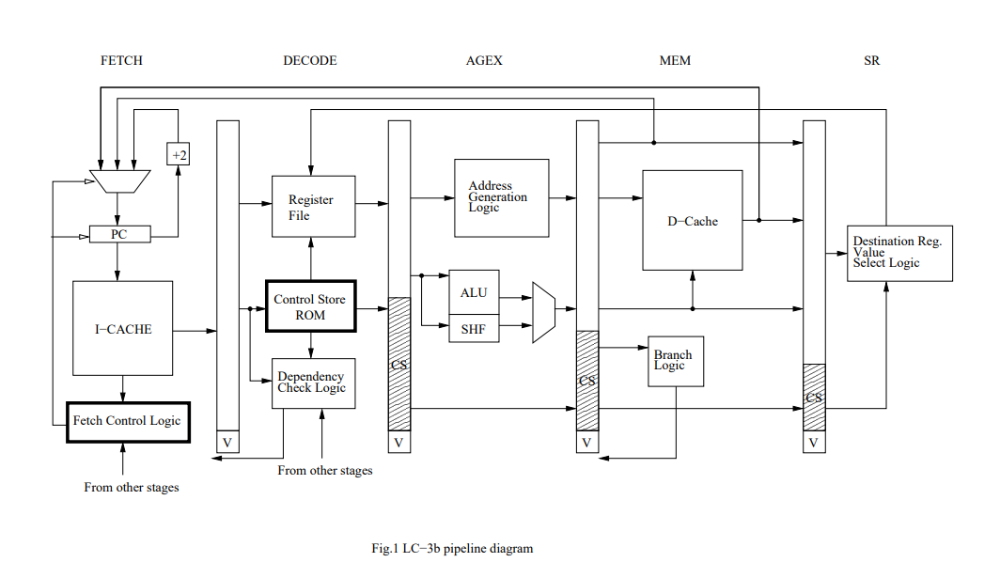
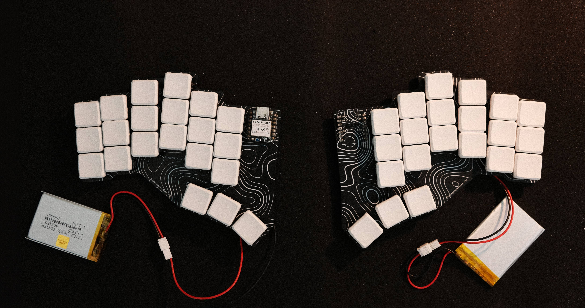
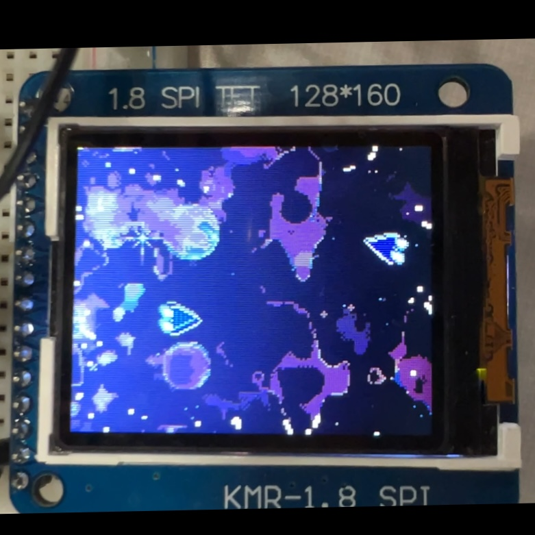

+++
title = "Resume"
extra.styles = ["widebody.css"]
+++

A full PDF of my resume can be found [here](Resume.pdf).  
If you are interested in any additional details, please feel free to [reach out](../contact).

# <colorize>__Experience__</colorize>
### Embedded Firmware Engineering Intern
***Lutron — Austin, TX***  
*Aug. 2023 – Jun. 2024 • Timer Interrupt-Driven Serial I/O*  
- Engineered redundancy communication protocol over GPIO, increasing reliability in daisy-chained system
- Utilized JTAG via J-Link for low-level debugging and memory inspection on ARM Cortex-M3 microcontrollers
- Designed serial protocol via interrupt-driven bit-banging in bare-metal C to redirect backup signals
- Reverse-engineered legacy firmware to maintain backward-compatible message routin

### BIOS Firmware Engineering Co-op
***AMD — Austin, TX***  
*Jan. 2025 – May 2025 • SBIOS/UEFI, EDK2, C Programming*
- Developed UEFI firmware drivers in C (EDK2) to capture in-band debug telemetry data and transmit to BMC
- Wrote PEI module to collect hardware registers, preserving critical error telemetry via Hand-Off Blocks
- Implemented DXE driver to retrieve and process error telemetry to preserve data for post-reboot analysis
- Created four drivers for EDK2 Redfish Client to transmit captured data to BMC via DMTF Redfish protocol

# <colorize>__Projects__</colorize>

### Programmable Stopwatch + Timer
*Nov. 2025 • RTL Design (Verilog), HLSM Modeling, Processor Micro-architecture, FPGA Prototyping (Basys3), Xilinx Vivado*  
- Formally specified and implemented programmable stopwatch/timer processor using HLSM and controller/datapath FSM decomposition
- Supported four modes (count up/down, default/input starting value) with well-defined state transitions for Start/Stop/Reset events
- Developed and verified modular RTL in Verilog for timing-critical logic, including 10ms tick generation, up/down BCD arithmetic, debounced and synchronized control inputs, and boundary condition handling (00.00, 99.99)
- Performed full functional simulation and synthesis in Xilinx Vivado, validating FSM correctness, timing accuracy, and corner cases before deploying verified bitstream to Basys3 FPGA

### Pipelined LC-3b Microarchitecture Simulator
<a href="https://github.com/samienr/ECE460N/tree/main/lab6/submission">
    <aside>
        
    </aside>
</a>

*Aug. 2024 – Dec. 2024 • Computer Architecture, Pipelining, C, Microarchitecture*  
- Wrote cycle-accurate five-stage pipelined LC-3b CPU simulator (Fetch, Decode, Execute, Memory, Writeback)
- Designed and integrated pipeline control logic, including hazard detection, stall insertion, and branch resolution
- Verified correction through simulation of assembly test programs
- Additionally wrote cycle-accurate multicycle LC-3b core simulator with support for interrupts, exceptions, and virtual memory

### Wireless Split Ergonomic Keyboard
<a href="../blog/keyboard/">
    <aside>
        
    </aside>
</a>

*Aug. 2023 – Jun. 2024 • PCB Design, ZMK Firmware*  
- Developed compact, reversible PCB layout using KiCAD, reducing manufacturing prices by 15%
- Interfaced Bluetooth using custom ZMK shield
- Programmed ZMK firmware to be deployed on Seeeduino Xiao nrf52840 development board

### Astro Party Embedded Video Game

<a href="https://github.com/samienr/Astro-Party-Embedded">
    <aside>
        
    </aside>
</a>

*Apr. 2024 – May. 2024 • Embedded C, C++, ARM32, Git*  
- Interfaced buttons, ADC, DAC, and an LCD screen to recreate Astro Party game on MSPM0+ microcontroller
- Implemented IO drivers in C and ARM assembly for LCD display over SPI and ADC
- Configured IO interfaces using GPIO for buttons, ADC slide potentiometer, DAC speaker, and LCD screen
- Leveraged edge interrupts and GPIO inputs for physics calculations in the game engin

# <colorize>__Education__</colorize>
#### Bachelor of Science, Electrical and Computer Engineering
*University of Texas at Austin • Expected grad. May. 2027*
- **Relevant Coursework:** *Computer Architecture, HDL, Embedded Systems + Lab, Operating Systems, Digital Logic Design, Circuit Theory, Data Structures, Algorithms, Linear Algebra*

# <colorize>__Skills__</colorize>

## **Computer Architecture**
- FPGA Development
- RTL Design
- SystemVerilog + Verilog
- Xilinx Vivado Design Suite
- Digilent Basys3 Artix7 FPGA Board

## **Embedded**
- JTAG Debugging
- I2C, SPI, UART, Bluetooth
- Timers, Interrupts, GPIO Usage
- PCB design, Oscilloscopes, Micro soldering
- Platforms:
    - STM32
    - Nordic NRF
    - SiLabs EFM32LG
    - Arm-Cortex M (TI MSPM0, TM4C123)

## **Software**
- Embedded C, C++, Python, ARM Assembly, Java
- UEFI/SBIOS, Linux, Seggar Ozone, EDK2, Git, KiCAD
- Object Oriented Programming

